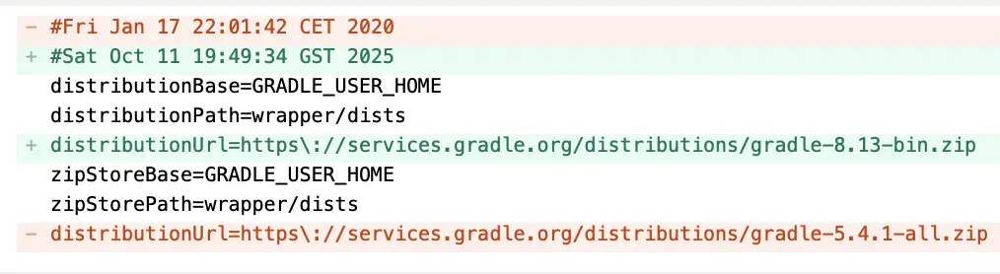

I wanted to make a simple post about an old project I once worked on. And this one is not the one I intended to make.

To write the post, I needed to make a screenshot.
To take that screenshot, I had to rebuild the project.

This project is rarely touched, and it was originally started with Ant and Eclipse — when there was no Android Studio yet. No surprise the IDE didn’t like the Gradle version 5.4.1, and insisted on 8.5. This started my Saturday evening journey to make a screenshot of the app…



Gemini CLI didn’t help a lot with the upgrade unfortunately. I spend around 20 minutes with upgrade of Gradle, configuration, and library versions. This wasn’t that bad as moving from Ant to Gradle :-D

The project was now successfully built… but something wasn’t right at the runtime. So I had to debug.

Android Studio, however, decided to fight back. It wouldn’t show Java variables at breakpoints until it finished indexing all files — including every single C++ file, even the ones outside the project. I increased the IDE max heap size to 5 GB — still no luck.

Come on, Android Studio, I don’t need C++ symbols indexed; I just want to see my Java variables!

Then I realized what was taking the entire indexing effort — my boost dependency. I realized that indeed, I used boost::filesystem for file operations, and the IDE was trying to index the entire Boost library, all the headers references in the Android.mk file.

“Fine,” I thought. “Let’s just remove Boost — C++17 already has std::filesystem. I’ll update the code.”

I asked Gemini CLI agent to remove the boost dependency with std::filesystem , it immediately burned my daily quota, and actually wasn’t even half done. I replaced it rather quickly myself with grep and sed. And also upgraded the compiler to C++17… and got an error about boost/geometry, which I’d completely forgotten was also there.
So I added Boost back to Android.mk.

This time, the build failed with a mysterious message:

```
error: no template named 'unary_function' in namespace 'std';
did you mean '__unary_function'?
```

Turns out my old Boost (1.69.0) doesn’t play well with C++17. I needed at least Boost 1.75.0.
Alright — time to update Boost.

Except… the Boost website no longer offers simple source archives (as it was back in 2014). Now there are only platform-specific .tar.gz bundles for Unix & Windows. So I went to GitHub and found the boost is modularized into independent repos (with umbrella repo present that includes everything with submodules). However, the point was to use only what is necessary to reduce the burden of Android Studio indexer, so I cloned boostorg/geometry and checked out “boost-1.75.0” tag.

What I got next was:

```
geometry.hpp:24:10: fatal error: 'boost/config.hpp' file not found
```

Basically, boost::geometry depends on the boost::config. No problem, lets do the same trick with the “boostorg/config”. Then another error of missing header of other lib. I ended up cloning assert, config, core, geometry,math,throw_exception … and the list kept expanding. Nah. This would not help me much if I have to include the whole boost lib again.

What was I doing…

Eventually, I rolled back the boost upgrade changes, and decided to increase the IDE heap size to the max 8192MB, and there were no indexing anymore. Breakpoint worked, and debugger showed me variable values.

All I wanted was a screenshot.
Hours later, I finally re-assembled the project and fixed the bug, learned about Boost modular repositories on Github, and questioned every career choice I’ve ever made ;-)