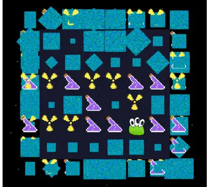

<!-- # Context -->

## The hook

I wrote a game in C++. Why? That was an application requirement back then. Zeptolab is the company produced famous Cut The Rope, first published in 2010, it has been downloaded more than 600M times. Addictive gameplay attracted not only players, but developers - many candidates applied for a job. Company announced that applicants should build a game on a given topic, e.g. Arkanoid, write it in C++, no frameworks, it should work on Android or iOS. Back then it was a tech choice in Zeptolab not to use well-known frameworks and built engine in-house.

Why should I apply as well? I started to work on what was most recently announced - pacman-like game. I just graduated from university and worked in iOS and Android app development. At that time I came across GamePlay3D - an open-source game engine and built a few simple things with it.

## Where do I start?

At the beginning, I focused on making a 2D game, where a hero would need to collect all the items and avoid toucing the enemy (ghosts) in a 2D labyrinth.



<!-- I few weeks later after the application, I decided why not try 3D - that would be even funnier and a challenge to myself. -->

There is a book called ["The Art of game design"](https://amzn.to/3DtvQkY) by Jesse Schell, and he describes the experiences players get from the game through game mechanics. One of them is called "the lens of surprise".

Would be really cool to surprise the player with something new. At first glance familiar-looking gameplay at the beginning, but when hero approaches the edge of the 
labyrinth, it would turn 90 degrees, revealing the other edge!

I must say that it was also used by a game called [Fez](https://en.wikipedia.org/wiki/Fez_(video_game)), released in 2012.

# Game level

Since I started with 2D and in the absence of any game engines, I needed capability of describing the game levels.
The simplest solution that came to my mind - was to code level as text bitmap.

That worked well for 2D, but when I turned to idea of rotating edges and cubic form, the bitmap needed to be extended.

How? Through [the net](https://en.wikipedia.org/wiki/Net_(polyhedron)) - an arrangement of edge-joining polygons (squares) constructing a polyhedron (cube) by connecting along the edges.

The final level configuration withe polyhedron net looked like the following:

```bash
backgroundColor=[0.0,0.0,0.0,1.0]
wallColor=[0.2,0.6,0.9,0.5]
cubeColor=[0.1,0.1,0.18,1.0]
color1=[0,0.7843,1.0,1.0]
color2=[0,0.3921,0.3921,1.0]
bounds=6x6
      .0.0..
      .0.00.
      0000..
      .0.000
      .000..
      ..0...
..0.....0.....0...
..0000000.00000...
000.0...C00.0.0.00
..0.0000..0..00G0.
00000..0.G0000.0..
..0....0.0....0...
      .0.0..
      .000..
      ..0.00
      0.000.
      .00.0.
      ..0...
      ..0...
      00000.
      .0.0..
      000000
      .0.0..
      .0.0..%
```

When the level is selected, the text bitmap is translated into 3D cube model with small boxes in each cell that form labyrinth. The zeros form a graph and characters move along the graph edges.
