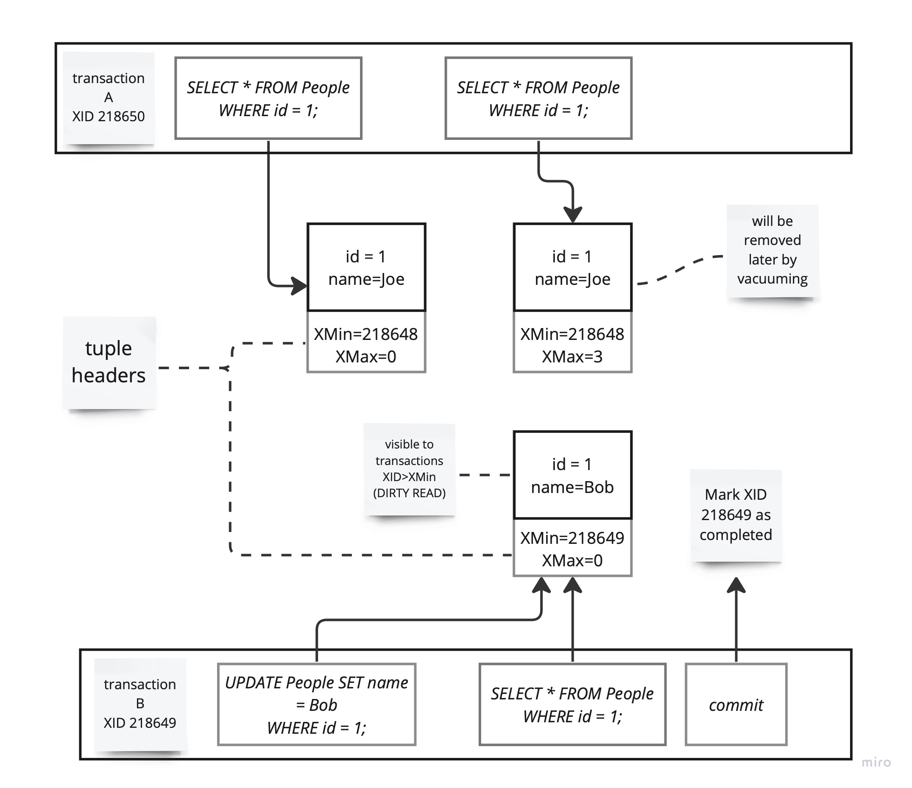
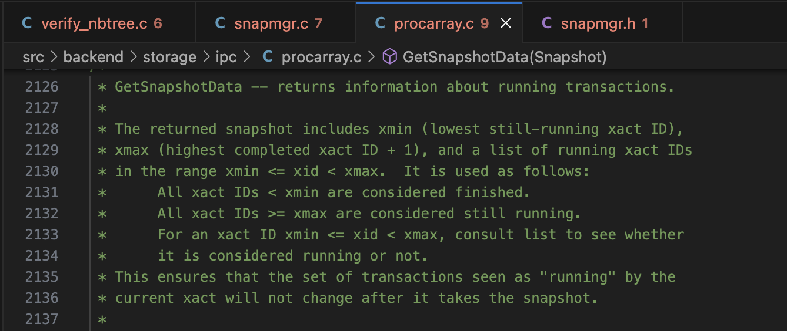
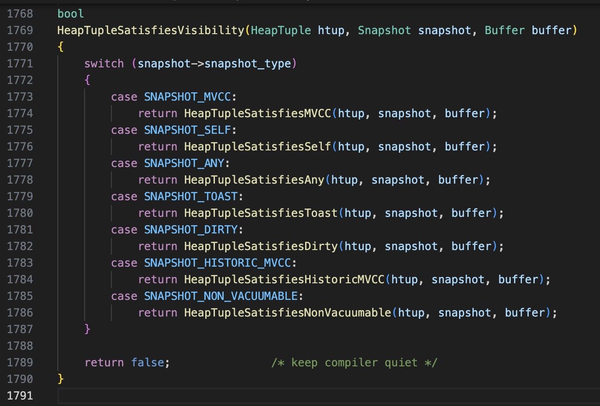

<!--  -->

Recently I was reading “Designing Data-Intensive Applications” book, and it ignited my interest to explore the source code of PostgreSQL, the database I mostly use, prompting me to delve deeper into the technical details behind its implementation and check out how aligned it is with what I learned from the book. According to statista it takes 4th place in most popular databases 2023. Typically first go Microsoft SQL, MySQL, Oracle and PostgreSQL.

By the way, databases are also discussed during the interviews, and typically questions cover indexing, ACID transaction properties, isolation levels, architecture, B-trees.

To make the study interesting and constructive and limit the study scope, I will try to answer a question - how does transaction isolation work in general, and how database maintains READ COMMITTED isolation level in particular?

There are 4 transaction isolation levels in PostgreSQL:

* DIRTY READ
* READ COMMITTED
* REPEATABLE READ
* SERIALIZABLE

Read committed level guarantees that transaction will see only committed results. Transaction won’t see uncommitted changes of other concurrently running transactions.

The diagram above illustrates non-repeatable read problem and read-committed guarantee. Transaction B accesses the same row twice. First time SELECT reads the value after the transaction A executed an update on that row, but before that change was committed. READ COMMITTED isolation level prevents dirty (uncommitted) reads. Next in a timeline, transaction A commits the changes and transaction B accesses that row again. This time it will read an updated row. This may be dangerous in certain contexts, e.g. financial domain when performing the changes in account’s balance.

## How does transaction isolation work in PostgreSQL?

PostgreSQL uses MVCC to allow concurrent read and write operations without locking the entire table. MVCC creates a snapshot of the database at the start of each transaction. Each transaction sees a snapshot of the database as of the transaction's start time. This snapshot-based approach allows for a high degree of concurrency. To achieve that PostgreSQL implements MVCC:

Versioning data - due to concurrent transactions there might be multiple versions of rows at a time visible to different transactions. Each row modification is associated with transaction, that either created, modified or deleted row. Each row also contains a visibility marker, indicating when row is visible and when it becomes invisible (after deletion or update).

Mark transaction with IDs - XIDs. Its 32bit transaction identifier used to track visibility and age of transactions.

Read transactions - when a transaction starts, it gets assigned a unique XID. During a read operation, a transaction sees only those rows with XID ranges that are considered "visible" according to its own XID. This way read transactions don't see changes made by concurrent write transactions that have not been yet committed.

Write transactions. When such transaction perform update or delete operation, it creates a new version of affected rows with new assigned XID. The "old" version of rows aren't removed yet. Those are marked as dead, and will become eligible for vacuuming.

This way PostgreSQL implements transaction isolation. Each transaction sees a snapshot of a database at a time transaction started, and changes made by other transactions after that point are not visible.

## What happens when row gets updated while being repeatably read by another transaction?

## Row update
When a transaction updates a tuple, it creates a new version of the tuple (AKA copy-on-write approach) with its own XID, and the old version's Xmax (Transaction ID of the last transaction to modify the tuple) is set to the XID of the updating transaction. Old tuple lifecycle is ended and future transactions should not see it (at least after commit).

Transaction 3 on the illustration updates a row. New tuple's header has XMin value equal to transaction XID - 3. Old tuple has XMax assigned to 3 as well, that may actually have a few interpretations depending on the other flags set in tuple header (e.g. xmax is also assigned when tuple is locked for update), but for simplicity I will omit those details.

This diagram explains very high level the MVCC implementation. There are more interesting things happen to the states of tuples, transactions and snapshots. For example, tuple state and its visibility is well described in [heapam_visibility.c](https://github.com/postgres/postgres/blob/master/src/backend/access/heap/heapam_visibility.c)

## Why don't concurrent transactions see new tuple until XID 3 is committed?

At a start up of each transaction, one requests a snapshot object, containing information about all running transactions. Let's have a look at [procarray.c](https://github.com/postgres/postgres/blob/cca97ce6a6653df7f4ec71ecd54944cc9a6c4c16/src/backend/storage/ipc/procarray.c#L2126) file and very descriptive comment of GetSnapshotData function:

Having a snapshot object describing currently running transactions and XIDs "boundaries" is quite helpful for complying with READ COMMITTED isolation level. From the example above, no other transaction of such isolation level will see "name = Bob" until transaction 3 is successfully committed.

[heapam_visibility.c](https://github.com/postgres/postgres/blob/master/src/backend/access/heap/heapam_visibility.c) seems to be the right place to look for understanding how a snapshot type impacts the tuple visibility for transaction.

Those functions rely on tuple header fields (Xmin, Xmax and a few flag values), snapshot object to determine the visibility of the tuple to other transactions.

## Garbage Collection
The Xmin and Xmax values are also used during the garbage collection process to determine which tuples are no longer visible to any active transaction. Tuples with an Xmax that is less than the current transaction's XID and when no other current transactions access the old tuple (e.g. deleted or replaced) - they can be safely removed during vacuuming.
