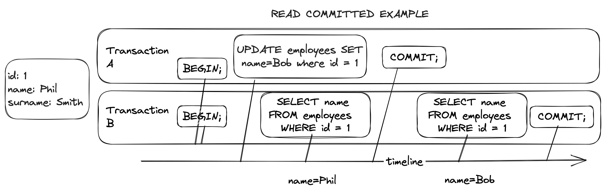
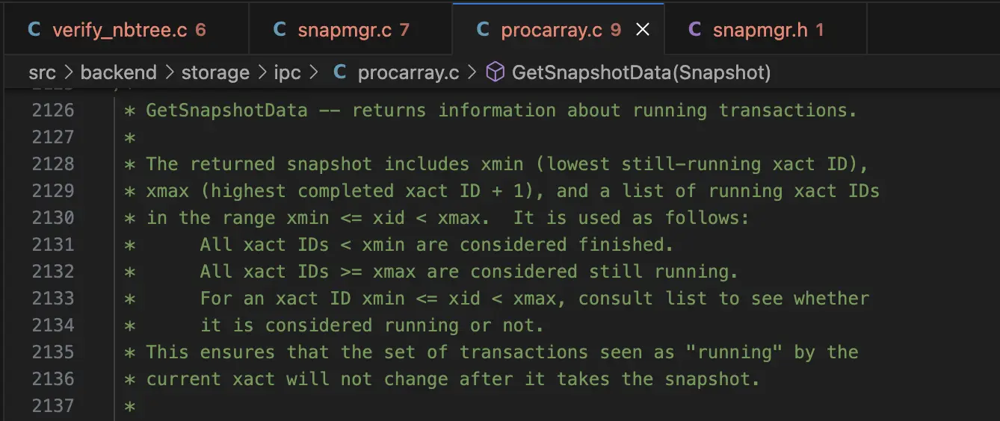
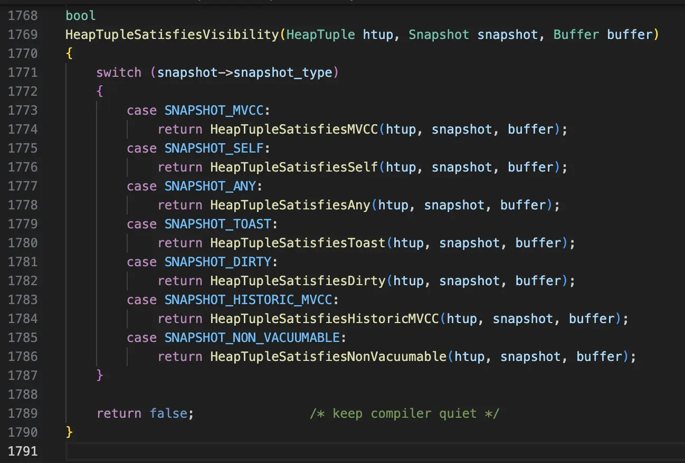

<!--  -->
Recently I was reading “Designing Data-Intensive Applications” book. It covers lots of topics related to creation of reliable, scalable and maintainable data systems and one of the chapter covers a concept of transactions - its meaning, use cases, levels of isolation and reasons why application developers should choose the right one. While many books and articles cover transaction isolation level with pure SQL examples for database users, I decided to go a bit deeper and check how a theory gets connected with actual implementation. As a software engineer with C++ background, it's interesting to check out the source code of one of the widely used open source databases - PostgreSQL. According to Statista it takes 4th place in most popular databases 2023. Typically first go Microsoft SQL, MySQL, Oracle and PostgreSQL.

To make the study interesting and constructive and limit the study scope, I will try to answer a question - how does transaction isolation work in general, and how database maintains READ COMMITTED isolation level in particular?

There are 4 transaction isolation levels in PostgreSQL:

* DIRTY READ

* READ COMMITTED

* REPEATABLE READ

* SERIALIZABLE

Read committed level guarantees that:

* transaction will see only committed results (no dirty reads). Transaction won’t see uncommitted changes of other concurrently running transactions

* writing to the database will overwrite only committed data (no dirty writes)

Let's start with some SQL code and illustrations, and then explore the source code. First create a simple table:

```
CREATE TABLE public.employees (
  id SERIAL PRIMARY KEY,
  name VARCHAR NOT NULL,
  surname VARCHAR NOT NULL,
);
```

One row is sufficient for our case:

```
INSERT INTO accounts ("name", "surname") VALUES ("Phil", "Smith")
```

Lets run the following magic query

```
# SELECT xmin, xmax, ctid, * FROM employees;
  xmin  | xmax | ctid  | id | name | surname 
--------+------+-------+----+------+---------
 218648 |    0 | (0,1) |  1 | Phil | Smith
(1 row)
```

Interesting numbers are in the response. Those are initial tuple attribute values for the inserted record of the first employee, but lets run two other transactions A and B concurrently (or sequentially for simplicity):

```
-- transaction A
BEGIN;
UPDATE employees SET name = "Bob" WHERE id = 1;
COMMIT;

-- transaction B
BEGIN;
SELECT name FROM employees WHERE id = 1;
SELECT name FROM employees WHERE id = 1;
COMMIT;
```

and run the magic query again

```
# SELECT xmin, xmax, ctid, * FROM employees;
  xmin  | xmax | ctid  | id | name | surname 
--------+------+-------+----+------+---------
 218651 |    0 | (0,2) |  1 | Bob  | Smith
```

`xmin` has slightly increased, and ctid has changed as well. Those are quite a clue for understanding how MVCC works. But let's take a step back and try to see what happens when those transactions run concurrently, i.e. what names become visible to transaction B.



The diagram above illustrates non-repeatable read problem with read-committed guarantee. Transaction B accesses the seemingly same row twice. First time SELECT reads the value after the transaction A executed an update on that row, but before that change was committed. READ COMMITTED isolation level prevents dirty (uncommitted) reads. Next in a timeline, transaction A commits the changes and transaction B accesses that row again. This time it will read an updated row, or actually a new tuple. By the way this may be dangerous in certain contexts, e.g. financial domain when performing the changes in account’s balance, thus for those tasks a stronger isolation might be needed.

## So how does transaction isolation work in PostgreSQL?

Without concurrency control, client may see inconsistent half-written data. The  way to guarantee consistent view is by introducing isolation for the requests, and the basic approach is through adding table level read-write locks, but such locks create a high level of contention between read and update transactions, resulting in very slow access. Here comes MVCC that allows concurrent read and write operations without locking the entire table. It may implement multiple levels of isolation, and Read Committed is a default one in PostgreSQL. What a particular transaction sees depends on its isolation level. With read committed level transactions see a snapshot of the database at the start of each transaction, i.e. see point-in-time consistent views. This isolation is achieved through data versioning - due to concurrent transactions there might be multiple versions of rows at a time visible to different transactions. Each row modification is associated with transaction, that either created, modified or deleted row. Each row also contains a visibility marker, indicating when row is visible and when it becomes invisible (after deletion or update). Isolation provides guarantees for concurrent data access.

## How exactly does MVCC track versions?

Remember that magic query we ran and the produced results? Let's try to understand what those mean and have a look at tuple declaration in http_details.h. HeapTupleFields catches my attention because it contains t_xmin, t_xmax and t_infomask from HeapTupleHeaderData also seems an important attribute - they seem to provide tuples with the necessary versioning, visibility levels required for transaction isolation. There are more attributes of course, but these must be describing the basic cases.

```
typedef struct HeapTupleFields
{
  TransactionId t_xmin; /* inserting xact ID */
  TransactionId t_xmax;	/* deleting or locking xact ID */
  union
  {
     CommandId t_cid; /* inserting or deleting command ID, or both */
     TransactionId t_xvac; /* old-style VACUUM FULL xact ID */
  } t_field3;
} HeapTupleFields;
```

From the same header I read that

* `t_infomask` is uint16 attribute and among other things it has bits enriching the `xmin` and `xmax` values, describing whether those are COMMITTED, INVALID or FROZEN.

* `xmin` - is used to store transaction XID, assigned at INSERT and UPDATE commands

* `xmax` - kinda invalidating or expiring a tuple, set by UPDATE or DELETE. It might be also used for row locks

## What happens when row gets updated while being repeatably read by another transaction?



### Create new tuple

When a transaction updates a tuple, it actually creates a new version of it (AKA copy-on-write approach) with its own XID and New tuple's header has XMin value equal to transaction XID - 218648.

### Mark old tuple for deletion

The old tuple's Xmax (Transaction ID of the last transaction to modify the tuple) is set to the XID of the updating transaction. Future transactions should not be able to see it (at least after commit). When tuple has non-zero xmax may actually have a few interpretations depending on the other flags set in tuple header (e.g. xmax is also assigned when tuple is locked for update), but for simplicity I will omit those details.

### Vacuum old tuple

The Xmin and Xmax values are also used during the garbage collection process to determine which tuples are no longer visible to any active transaction. Tuples with an Xmax that is less than the current transaction's XID and when no other current transactions access the old tuple (e.g. deleted or replaced) - they can be safely removed during vacuuming.

There are more interesting things happen to the states of tuples, transactions and snapshots. For example, tuple state and its visibility is well described in [heapam_visibility.c](https://github.com/postgres/postgres/blob/master/src/backend/access/heap/heapam_visibility.c)

## Why don't concurrent transactions see new tuple until XID 218649 is committed?

At a start up of each transaction, one requests a snapshot object, containing information about all running transactions. Let's have a look at procarray.c file and very descriptive comment of GetSnapshotData function:


Having a snapshot object describing currently running transactions and XIDs "boundaries" is quite helpful for complying with READ COMMITTED isolation level. From the example above, no other transaction of such isolation level will see "name = Bob" until transaction 3 is successfully committed.

[heapam_visibility.c](https://github.com/postgres/postgres/blob/master/src/backend/access/heap/heapam_visibility.c) seems to be the right place to look for understanding how a snapshot type impacts the tuple visibility for transaction.



Those functions rely on tuple header fields (Xmin, Xmax and a few flag values), snapshot object to determine the visibility of the tuple to other transactions.

## The end

It was surprisingly fun to read PostgreSQL source code. Git blame reported that some lines were more than 20 years old. Methods frequently are well documented with comments and not only describe what a particular function does, but also conditions under which this function must be invoked, what kind of locks it uses, what optimisations were tried before, etc. For those who wants to dig deeper and explore the tuple states I recommend to start with [htup_details.h](https://github.com/postgres/postgres/blob/cca97ce6a6653df7f4ec71ecd54944cc9a6c4c16/src/include/access/htup_details.h).

